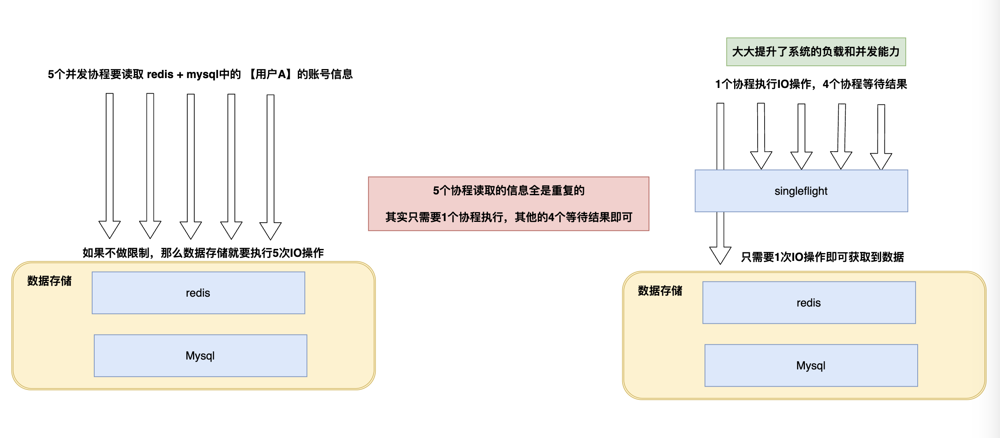
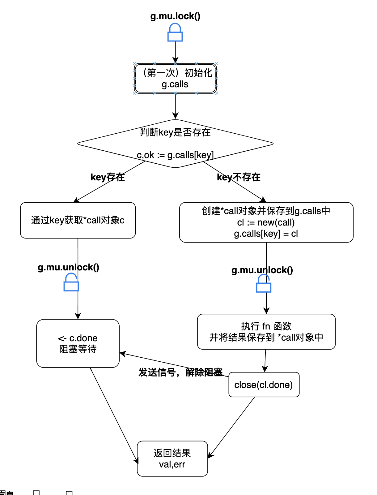

# Golang实现singleflight


代码地址: https://github.com/gofish2020/easysingleflight

### 好处
提升系统的高可用性，避免突发的大流量导致整个系统的熔断。





### 代码分析

代码的实现就是利用**锁+map**这两个基本的数据结构
- 锁：保证每次只放行一个请求
- map：保证同一种类型请求（通过key来指定同类型），复用同一个处理结果


```go
type (
	Group struct {
		calls map[string]*call // 懒初始化
		mu    sync.Mutex
	}
)
```

`call`的作用就是存储结果

```go
type (
	call struct {
		done chan struct{} // 处理完成的通知通道

		val interface{} // 结果
		err error       // 是否出错
	}
)

```

核心方法只有一个`Do`方法,代码流程图如下



代码的核心就是通过`key`在`g.calls`中查找是否存在相同的 `*call`对象;

- 存在就使用该 `*call`对象，阻塞等待结果...
- 不存在，就创建一个新的`*call`对象，将函数`fn`的执行结果保存到`*call`对象中，通过`done`解除阻塞

```go
// bool值表示：本次返回值是缓存值，还是实际走的fn函数
func (g *Group) Do(key string, fn func() (interface{}, error)) (interface{}, error, bool) {

	// 1.加锁
	g.mu.Lock()
	if g.calls == nil {
		g.calls = make(map[string]*call)
	}

	// 2.key存在，说明有重复的调用，只能等待...
	if c, ok := g.calls[key]; ok {
		g.mu.Unlock()
		<-c.done // 阻塞等待结果中..
		return c.val, c.err, true
	}

	// 3.key不存在，说明这是第一个调用
	cl := new(call)
	cl.done = make(chan struct{})
	g.calls[key] = cl
	// 4. 在执行fn前解锁
	g.mu.Unlock()

	func() {
		//defer 目的避免fn出现panic
		defer func() {

			if p := recover(); p != nil {
				cl.err = newPanicError(p)
				cl.val = nil
			}

			// 6. 删除key
			g.mu.Lock()
			delete(g.calls, key)
			g.mu.Unlock()
			// 7.通知阻塞在该call的协程,结束阻塞（呼应上面的阻塞）
			close(cl.done)
		}()
		// 5.执行fn
		cl.val, cl.err = fn()
	}()

	return cl.val, cl.err, false
}

```